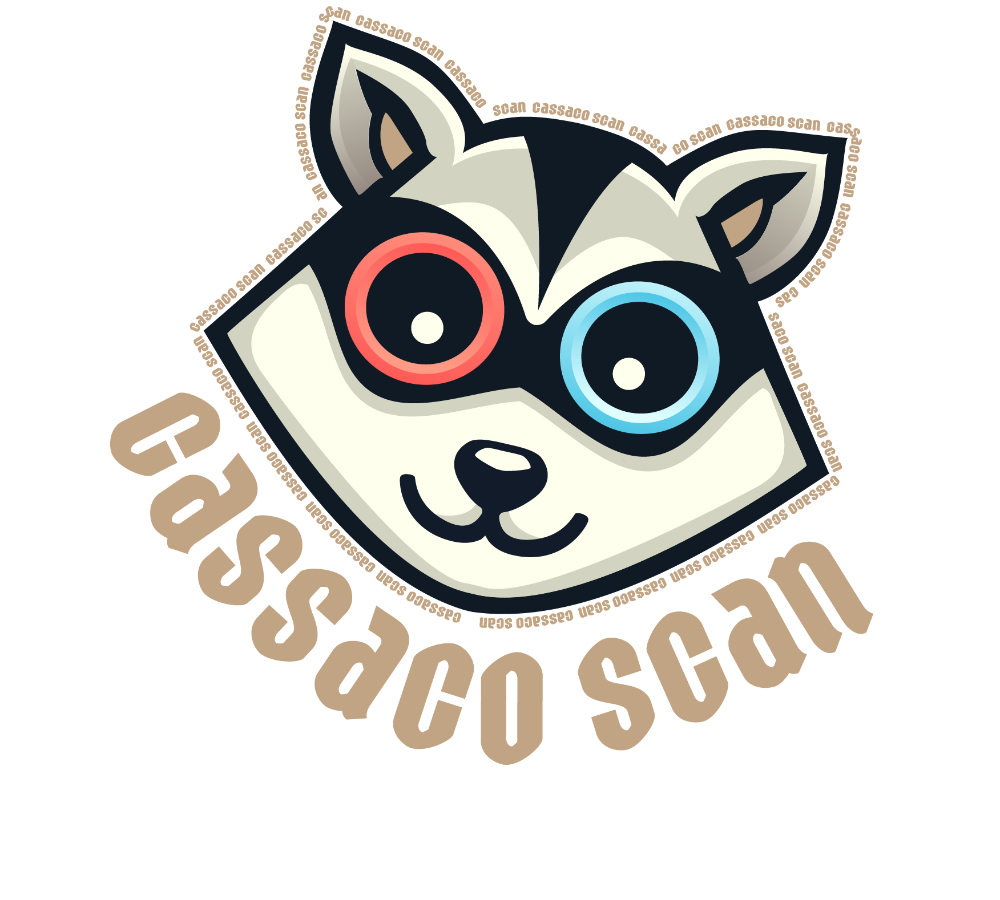

<h1 align="center">Cassaco Scan</h1>
<p align="center" width="100%">
     
</p>

Este projeto é uma aplicação web que permite capturar ou carregar imagens de um cardápio, extrai texto da imagem utilizando OCR (Optical Character Recognition) com Tesseract.js e envia os dados para a API do OpenAI (GPT-4), que por sua vez retornará um JSON com os metadados do texto extraído.

## Tecnologias Utilizadas

- **HTML**
- **CSS**
- **Node.js**
- **Tailwind CSS**
- **JavaScript**
- **Tesseract.js**
- **OpenAI API**

## Estrutura do projeto

```
prompt-menu-crud/
├── dist/
│ ├── styles.css
├── node_modules/
├── src/
│ ├── app.js
│ ├── styles.css
├── package.json
├── package-lock.json
├── tailwind.config.js
├── postcss.config.js
├── index.html
├── README.md
├── .gitignore
└── .prettierrc
```

## Dependências(estão listadas no package.json e serão instaladas automaticamente com o uso do npm)

- `autoprefixer@10.4.20`
- `class-variance-authority@0.7.1`
- `clsx@2.1.1`
- `lucide-react@0.469.0`
- `postcss@8.4.49`
- `prettier@3.4.2`
- `shadcn-ui@0.9.4`
- `tailwind-merge@2.6.0`
- `tailwindcss-animate@1.0.7`
- `tailwindcss@3.4.17`

## Pré-requisitos

Para rodar o projeto localmente, você precisará de:

- [Node.js](https://nodejs.org/en/download) (versão 22.12.0 ou superior com npm)
- Uma chave de API da OpenAI funcional
- Um editor de código(Recomendado VSCode)
- Instalar a extensão Live Server no VSCode
- No iOS: Chrome 115 ou versão mais recente

## Configuração da API da OpenAI

1. Acesse [OpenAI](https://platform.openai.com/signup) e crie uma conta, caso ainda não tenha uma.
2. Após o login, acesse [API Keys](https://platform.openai.com/account/api-keys) e gere uma nova chave de API.
3. Você deve colar sua API KEY no arquivo [app.js], deve substituir "--api-key--" pela sua chave e salvar. Esse é o trecho do javascript(linha 146):
   ```javascript
   Authorization: 'Bearer --api-key--'; // API key goes here
   ```

## Instalação

1. Abra o terminal no editor de código e clone o repositório:

   ```bash
    git clone https://github.com/ricartesamuel/prompt-menu-crud.git
   ```

2. Navegue até a pasta do projeto:

   ```bash
    cd prompt-menu-crud
   ```

3. Instale as dependências e compile o CSS:
   ```bash
    npm install
    npm run build
   ```
4. Com as dependências instaladas e a extensão do Live server instalado no VSCode execute:
   ```bash
    npm run start
   ```

## Como Usar a aplicação

Tirar Foto:
Clique no botão "TIRAR FOTO" para capturar uma imagem usando a câmera do dispositivo.

Carregar Imagem:
Clique no botão "CARREGAR IMAGEM" para selecionar uma imagem do seu dispositivo. Apenas arquivos com formato de imagem são válidos.

Confirmar e Processar:
Após capturar ou carregar a imagem, clique em "ENVIAR PARA IA" para processar o texto da imagem e gerar o JSON.

Copiar Resultado:
O JSON gerado pode ser copiado para a área de transferência clicando em "COPIAR JSON".

Reiniciar:
Clique em "TENTAR NOVAMENTE" para reiniciar o processo.
